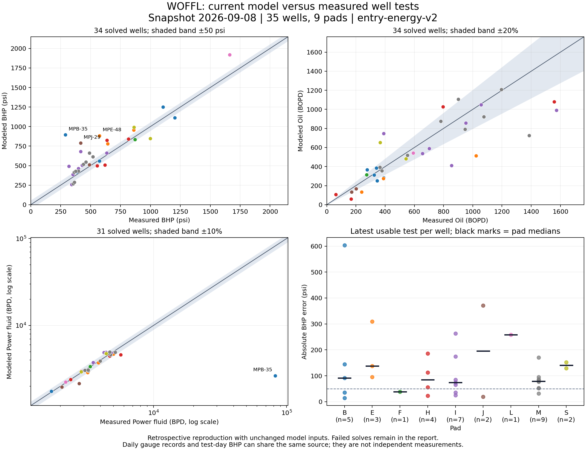

# Fleet model actuality — 2026-09-08

Databricks access worked. The audit captured current inputs and observations in **12 bulk SELECT queries**, then ran offline with **two workers**. No calibration was refitted or saved, and no production data or deployment was changed.

The model currently reproduces BHP unevenly across the fleet: **85.6 psi median absolute error** on 34 solved latest tests, with **1 failed solve**. PF and oil median absolute percentage errors are **4.6%** and **20.0%**, respectively.

## Coverage and scope

- 90 wells in the app's supported model universe. The source gauge registry covers 487 MPU well records; this is not a model audit of all 487.
- 60 app wells have credible BHP (>50 psi) within 14 days; 46 also have tests within 90 days.
- **35 wells across 9 pads** have usable tests after their current pump installation: B, E, F, H, I, J, L, M, S.
- 178 test observations and 1737 daily operating observations scored. These overlap on some dates and should not be added as independent measurements.
- Each test uses its measured PF pressure and wellhead pressure. IPR, watercut, GOR, geometry and loss coefficients remain as the app hydrates them today. Missing/zero test PF volume leaves PF accuracy unscored while BHP/oil remain usable.
- Daily comparisons require credible BHP, PF pressure, production pressure and net PF >500 BPD. No centered BHP smoothing or exclusion based on model error was applied.
- Prior-pump tests, installation-day tests, and circulation conflicts are excluded and listed in the CSV. Current gauge readings do not guarantee that the latest rate test is recent.

These are **retrospective reproductions**, not an independent qualification. Saved/automatically fitted inputs may incorporate scored tests. The after-save subset is reported separately but still uses current geometry, fluid assumptions and model v2. The earlier three-well report used newly trained event fits and frozen training IPR; its 23–59 psi RMS is a different experiment. Comparisons assume the cleaned gauge BHP represents pump suction pressure; gauge calibration and pressure-datum equivalence were not independently verified.

## Errors

Errors are model minus measured. Latest-test statistics give each well one observation. Full-history statistics weight wells by their number of observations. Numerical error statistics cover successful solves; failures remain explicitly counted.

| Comparison | Observations / failed | BHP median absolute / RMS, psi | PF median absolute / RMS, % | Oil median absolute / RMS, % |
|---|---:|---:|---:|---:|
| Latest usable test per well | 35 / 1 | 85.6 / 172.0 | 4.6 / 19.0 | 20.0 / 35.4 |
| All current-era tests | 178 / 11 | 94.8 / 135.4 | 4.0 / 14.3 | 24.5 / 42.9 |
| Daily operating observations | 1737 / 89 | 68.9 / 139.5 | 5.3 / 35.3 | — / — |
| Tests after known saved inputs | 51 / 0 | 78.0 / 160.4 | 4.4 / 16.1 | 22.7 / 35.1 |

Among latest solved tests: **8/34** are within 50 psi BHP; **25/31** within 10% PF; **17/34** within 20% oil. These are reporting bands, not acceptance standards.

## Findings that need attention

1. **BHP errors persist beyond stale inputs.** Updating the diagnostic IPR anchor, WC and GOR to the measured latest test reduces some errors, but large differences remain on MPB-35, MPJ-29 and MPE-48. This diagnostic explicitly uses measured BHP/oil as inputs and is not independent validation.
2. **Composition inputs often differ from tests.** 16/35 wells differ by over 10 watercut percentage points. That can materially affect IPR and multiphase flow; it does not by itself identify which input is correct.
3. **MPB-35's latest test reports 82,133.56 BPD PF.** It remains in the raw error statistics and strongly affects PF RMS. This record needs reconciliation with PF metering/allocation and pump identity; no value was silently corrected or discarded.
4. **MPI-24 has a circulation conflict.** The current tracker/model says forward; the test pressure signals resolve as annulus PF (reverse). It is excluded pending reconciliation, rather than solving the wrong flow path.
5. **MPF-73 is producing in the observations but the configured model cannot lift at maximum suction.** This is a substantive model/input failure, retained in the scorecard.
6. **A good level match can hide a response mismatch.** MPB-37, MPH-19, MPJ-27 and MPM-16 have observational pressure-response slopes around 0.07–0.14 psi/psi while their frozen model is pinned. Pair statistics restrict time separation to 3–30 days, PF separation to at least 100 psi and WHP change to at most 25 psi. They are correlated and can include changing reservoir/test conditions; they do not establish causal PF response.

Do not loosen physics acceptance tests to fit this dataset. First reconcile the highlighted measurement/configuration conflicts, then revisit the worst well models with explicit event holdouts. The shared-energy consistency tests remain a separate requirement.

## Largest latest-test BHP errors

| Well | Test date | Measured / modeled BHP, psi | Signed error, psi | Oil error, % | PF error, % |
|---|---|---:|---:|---:|---:|
| MPB-35 | 2026-09-05 | 290 / 894 | +604 | -27.5 | -96.8 |
| MPJ-29 | 2026-09-02 | 417 / 788 | +371 | -16.4 | -4.3 |
| MPE-48 | 2026-08-17 | 574 / 883 | +309 | -49.6 | -6.2 |
| MPI-22 | 2026-09-02 | 417 / 680 | +263 | -37.0 | +1.7 |
| MPL-06 | 2026-09-02 | 1662 / 1920 | +259 | -8.3 | +1.8 |
| MPH-32 | 2026-08-26 | 637 / 823 | +186 | -30.7 | -18.9 |
| MPI-27 | 2026-09-01 | 319 / 493 | +175 | -16.1 | +2.6 |
| MPM-62 | 2026-08-14 | 490 / 661 | +170 | -47.6 | +8.4 |
| MPS-204 | 2026-08-01 | 999 / 847 | -152 | +78.7 | +2.2 |
| MPB-28 | 2026-08-14 | 1106 / 1251 | +144 | -27.3 | unavailable |

## Pad coverage

Small pad samples are shown as coverage, not pad rankings.

| Pad | Wells / failures | Median absolute BHP error, psi | Median absolute oil error, % |
|---|---:|---:|---:|
| B | 5 / 0 | 91.6 | 27.3 |
| E | 3 / 0 | 137.6 | 43.6 |
| F | 2 / 1 | 38.7 | 14.7 |
| H | 4 / 0 | 84.2 | 47.2 |
| I | 7 / 0 | 73.9 | 18.1 |
| J | 2 / 0 | 195.3 | 19.1 |
| L | 1 / 0 | 258.6 | 8.3 |
| M | 9 / 0 | 78.9 | 12.2 |
| S | 2 / 0 | 140.6 | 44.8 |

## Artifacts and replay



- [Searchable well scorecard](fleet_actuality_2026-09-08.html)
- [Well-level CSV, including exclusions](fleet_actuality_2026-09-08.csv)
- [Observation-level CSV](fleet_actuality_2026-09-08_observations.csv)
- [Full metrics, fixed inputs and conditional diagnostics](fleet_actuality_2026-09-08.json)

The raw snapshot stays in ignored `build/fleet-actuality-snapshot.pkl`. Source tables are `vw_bhp_tags`, `vw_bhp_daily_clean`, `vw_well_test`, `vw_pressure_daily`, `vw_power_fluid_volume`, well characteristics, JP tracker and saved property history. The cleaned daily gauge and pressure-view BHP agree exactly on 5,385 credible paired records in the app's 90-day window; they are the same evidence source, not a second validation.

Replay without additional warehouse reads:

```powershell
$env:PYTHONPATH='.'
./venv/Scripts/python.exe tools/fleet_actuality.py
./venv/Scripts/python.exe tools/render_fleet_actuality.py docs/fleet_actuality_2026-09-08.json
```

Refresh the snapshot explicitly with `tools/fleet_actuality.py --live --fetch-only`. Neither script writes to Databricks. Offline audit regression tests cover chronology, missing PF, direction conflicts, label isolation and failure accounting.

Validation: eight new fleet-audit regressions pass. The final full offline suite passed 1,817 tests. The figure was visually inspected; HTML scorecard sorting/filtering and artifact links were checked locally.
