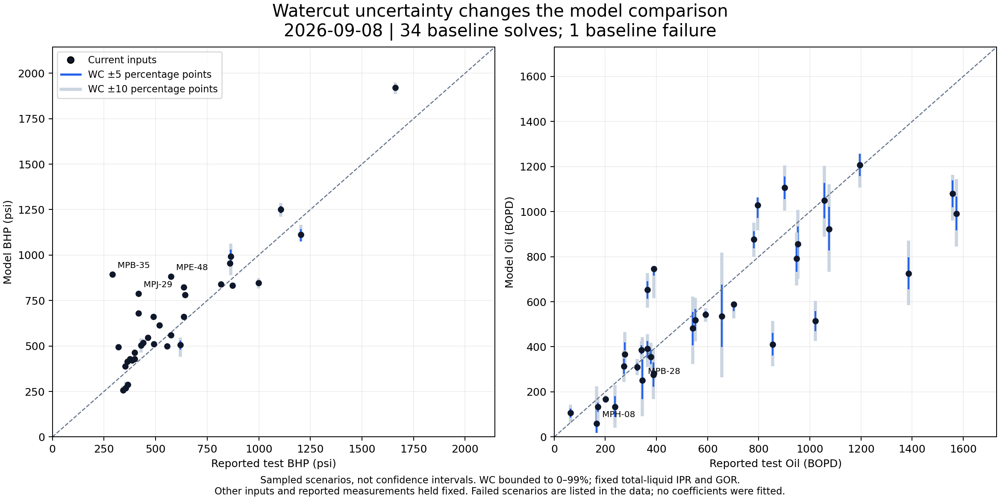

# Fleet watercut sensitivity — 2026-09-08

This is an offline sensitivity experiment on the same 35 wells in the fleet comparison. It is not a new accuracy score or a calibration. All 35 unperturbed replays reproduced the source success/failure status; successful BHP, oil and PF outputs matched within 1e-8 in their original units. No warehouse reads, saved input changes or application changes were required.



## Assumptions

- WC is formation-water fraction, excluding returned power fluid. Sweep ±10 percentage points in 2.5-point steps around each configured WC, bounded to 0–99%. The ±5-point band uses its five interior samples. Near 0/99%, bands are truncated.
- Hold total-liquid IPR reference rate (`qwf`), reference BHP, reservoir pressure, pump, losses, fluid properties and the latest test's operating pressures fixed. Changing WC changes the derived oil IPR once, using `oil = liquid * (1 - WC)`. The resulting operating liquid rate can change through the hydraulic solve.
- `fixed_gor` holds gas per stock-tank oil fixed (the ordinary WC-only model input change). `fixed_gas_per_liquid` also adjusts GOR so `GOR * (1 - WC)` is constant: gas per barrel of formation liquid, and therefore gas at the unchanged IPR reference rate, stays fixed. This is not a fixed operating gas-rate constraint.
- Test WC substitution changes WC only under each gas convention; it does not re-anchor IPR on measured BHP/oil. No WC was selected or saved to improve fit.
- These are illustrative ranges, not measured WC errors or statistical confidence intervals. Each reported test coordinate remains fixed in the figure. Real WC measurement error can move the reported oil coordinate too, and total-liquid/PF errors can be correlated. Thus this is only one part of the uncertainty.

## Quantified sensitivity

For each well, take the largest absolute change from its current prediction among the successful sampled scenarios. Then take the median across 34 baseline successes. Failed scenarios remain recorded and do not contribute invented bounds.

| Gas assumption | WC band, points | Median max BHP change, psi | Largest BHP change, psi | Median max oil change, % | Wells still >50 psi off at every successful sample | Failed scenarios |
|---|---:|---:|---:|---:|---:|---:|
| fixed_gor | ±5 | 5.1 | 45.4 | 8.9 | 25/34 | 5 |
| fixed_gor | ±10 | 10.9 | 102.1 | 17.9 | 20/34 | 11 |
| fixed_gas_per_liquid | ±5 | 1.1 | 4.4 | 8.4 | 25/34 | 5 |
| fixed_gas_per_liquid | ±10 | 2.3 | 10.7 | 16.9 | 25/34 | 9 |

There are 22 failed requested scenarios across the full experiment (including the test-WC substitutions and repeated clipped endpoints). A missing prediction is not evidence of a narrow range. The JSON retains each failure and its inputs.

The count of residuals above 50 psi is an optimistic diagnostic that allows choosing a different WC for each well after seeing its BHP. It is not an improvement claim, a fit or an independent validation.

## Selected wells

Ranges below use fixed GOR and ±5 WC points. Observed BHP does not change.

| Well | Model / test WC, % | Observed BHP, psi | Current BHP, psi | Sampled BHP range, psi | Current oil, BOPD | Sampled oil range, BOPD |
|---|---:|---:|---:|---:|---:|---:|
| MPB-28 | 83.0 / 84.4 | 1106 | 1251 | 1231–1269 | 251 | 167–343 |
| MPB-35 | 0.0 / 0.0 | 290 | 894 | 894–899 | 282 | 267–282 |
| MPE-24 | 85.6 / 88.6 | 861 | 956 | 955–956 | 134 | 87–182 |
| MPE-48 | 42.8 / 29.3 | 574 | 883 | 883–883 | 514 | 470–559 |
| MPH-08 | 96.4 / 96.4 | 817 | 841 | 841–841 | 60 | 17–143 |
| MPI-22 | 21.8 / 1.4 | 417 | 680 | 674–685 | 991 | 917–1067 |
| MPJ-29 | 15.1 / 51.9 | 417 | 788 | 788–789 | 168 | 159–176 |

## Interpretation

WC can move the oil prediction substantially, especially at high WC. In this model, the typical BHP response to an isolated WC change is much smaller than the existing fleet BHP error. Holding gas per liquid fixed makes BHP sensitivity smaller still. This result does not establish the true field sensitivity or rule out larger BHP errors caused by correlated liquid-rate, gas, PF or IPR errors.

The prior fleet report's test-conditioned diagnostic changed WC, GOR and the IPR anchor together. Improvements there cannot be attributed to WC alone.

## How to improve the comparison and calibration

1. Establish a realistic WC uncertainty per test from repeat samples and test conditions. A five-point error at 80% WC changes derived oil by 25% at fixed formation-liquid rate: 1,000 BLPD gives 200 BOPD at 80% versus 150 at 85%.
2. Compare BHP, formation liquid, PF and oil together. Comparing WC to `1 - oil / formation_liquid` across 35 latest tests gives a maximum difference of 1.1e-14 percentage points. Internal consistency is not independent verification of those measurements. Reconcile returned PF before using surface water to estimate formation WC.
3. The multipoint fitter already uses Huber losses and point weights for BHP/PF residuals. Its oil test enters the per-point IPR anchor, while WC/GOR are fixed inputs. Extend that existing framework to vary composition and dependent rate inputs coherently within evidence-based bounds, with a penalty for departing from the test estimate. BHP/PF weights also need gauge-datum and metering checks; those observations are not automatically correct.
4. Validate on later, stable operating periods within the same pump installation, with training inputs frozen. Check pressure response as well as level match. Keep large unresolved BHP errors and failed solves visible.
5. Evaluate optimization moves at low/base/high credible WC and show the gain range. Prefer moves that stay beneficial across those scenarios; flag cases whose recommendation changes with WC. Keep existing physics conservation tests separate from uncertain field fit scores.

These are proposed follow-ups. This experiment does not modify the live optimizer, calibration, Medium deployment or physics acceptance thresholds.

## Reproduction

```powershell
./venv/Scripts/python.exe tools/fleet_watercut_sensitivity.py
```

Source JSON SHA-256: `b113f411c6ebb148a694beaa9dd3aef3780938c1e9546e1a5417fcabb46c6cf0`. [All scenarios](fleet_watercut_sensitivity_2026-09-08.json). Two-worker ceiling; source queries blocked.
