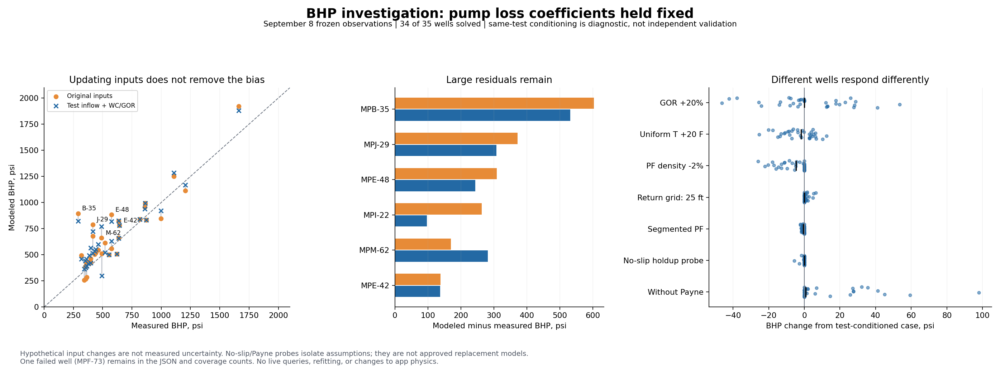

# Jet-pump model improvement plan — September 11, 2026

Current stopping state and ordered next actions: [end-of-night handoff](session_close_2026-09-11.md).

The target is a model that explains a well across several pump installations
and operating conditions, then predicts changes on other wells. Matching one
test by moving loss coefficients is insufficient. The user also wants selectable
wellbore hydraulics and a visible **Pump Match Over Time** comparison, preferably
on the existing production/history plot, to support optimization decisions.

This plan includes possible incorrect physics. Numerical consistency, agreement
with field observations, and predictive value for optimization are separate
requirements. The [selectable hydraulics implementation](hydraulics_models_2026-09-11.md)
adds Hagedorn–Brown/Griffith and Shi/Pan alongside the unchanged BB default.
Tulsa is still unavailable. Same-input historical comparisons show that a
better BHP match can worsen oil prediction, so these alternatives are not
qualified sizing models.

**After resuming:** the user clarified that the primary goal is predicting
JP-size choices at the applicable pad/field marginal WC. Tracker dimensions
are nominal specs, never measurements of wear; gauges are typically within
40 ft of the JP. The two P0 application fixes below are implemented, and a
six-well chronological reference benchmark now exists. Read the
[resume record](jp_model_resume_2026-09-11.md) for results, limitations and the
ordered plan for validating incremental oil versus incremental machine water.

## What the BHP plot actually establishes

The [original fleet plot](fleet_actuality_2026-09-08.png) is a September 8 frozen
retrospective comparison, before installed-pump-scoped fit hydration. It is not
a fresh audit of today's saved fits. This investigation replayed its 35 wells:
34 solved, and their BHP predictions reproduced **exactly**. MPF-73 still failed.

On the 34 successes, modeled BHP is high on 25 wells, with mean signed error
**+82 psi**, median absolute error **86 psi**, and RMS error **172 psi**. Only
8/34 are within 50 psi. PF median absolute error is 4.6% across 31 scorable
wells, while oil median absolute error is 20.0%. These bands are descriptive,
not agreed acceptance standards. MPB-35's reported 82,134 BPD PF allocation is
suspect and stays visible in the raw score.

The recorded loss coefficients were deliberately retained to isolate other
effects. Some are legacy fits, so remaining errors cannot be attributed solely
to incorrect physics. Establish a new baseline using the current installation
and model-version scope rules before qualifying or refitting any model. Keep
that baseline separate from this preserved plot.

Fourteen variants were evaluated for every well, holding the recorded pump loss
coefficients and nozzle multiplier fixed. The resulting 490 requested solves
include failures; no per-well winning perturbation was chosen or saved.
[Reproducible tool](../tools/bhp_model_diagnostic.py),
[all results and pressure balances](bhp_model_diagnostic_2026-09-11.json).

| Diagnostic | BHP median absolute error, psi | BHP RMS, psi | Interpretation |
|---|---:|---:|---|
| Original frozen inputs | 85.6 | 172.0 | Retrospective baseline |
| Test WC/GOR, original oil IPR preserved | 102.3 | 177.8 | Composition alone does not cure the mismatch |
| Test oil/BHP IPR anchor, original composition | 81.4 | 170.2 | Inflow alone does not cure it either |
| Test oil/BHP anchor and test WC/GOR | 101.5 | 160.0 | Some outliers improve, but typical error worsens |

The last three rows are **same-test diagnostics**, not validation: some use the
observed BHP/oil as inputs. They help locate the problem; they do not prove a
forecast improvement. In the composition-only case the original oil IPR is
preserved deliberately, avoiding an accidental second change to oil capacity.

| Well | Original BHP error, psi | After same-test inflow/composition, psi | First investigation |
|---|---:|---:|---|
| MPB-35 | +604 | +531 | PF allocation, gauge datum, pump pressure recovery |
| MPJ-29 | +371 | +308 | Datum and pump pressure recovery; return friction is too small to explain the deficit |
| MPE-48 | +309 | +243 | Conflicting hardware dimensions, installed-fit provenance, pump recovery |
| MPI-22 | +263 | +97 | Composition/inflow and the entry-flow limit |
| MPM-62 | +170 | +282 | Hardware dimensions and the entry-flow limit |
| MPE-42 | +138 | +138 | Low-GOR pump balance and measured response across 11C/13C installations |

MPE-42 here uses the frozen default-loss configuration. The earlier screenshot's
single-test fit (about 705 versus 643 psi) is a different configuration; do not
combine those numbers into a claimed before/after improvement.

## What changing hydraulics is likely to help

The initial diagnostic used **Beggs–Brill with the Payne correction**; at that
time the traverse's `model` argument did not dispatch. The later implementation
now dispatches to BB, Hagedorn–Brown/Griffith or Shi/Pan. The traverse still uses
one temperature, 100-ft spacing and a uniform tubing or annular section.
PF static head/friction use bulk properties. These are modeling assumptions,
not evidence that every equation is incorrect.

The new probes isolate their immediate influence on this snapshot:

| Change from the same-test diagnostic | Median absolute BHP movement, psi | Maximum movement, psi |
|---|---:|---:|
| GOR increased 20% | 13.3 | 53.5 |
| Uniform temperature increased 20°F | 6.3 | 25.2 |
| Standard PF density decreased 2% | 4.7 | 26.0 |
| Return mesh refined from 100 to 25 ft | 0.06 | 6.54 |
| Isothermal PF traverse with local pressure-dependent properties | 0.68 | 2.25 |
| BB holdup forced to its no-slip limit | 0.0 | 5.64 |
| Payne correction removed | 0.73 | 97.92 |

The input perturbations are hypothetical, not measured uncertainty ranges.
The no-slip probe retains the other BB terms and is **not** a qualified
homogeneous-flow correlation. Removing Payne generally raises BHP and worsens
this particular fleet comparison. These experiments do not rule out a different
correlation helping other conditions or a proper thermal model helping; they
do rule out treating mesh refinement or small PF-density corrections as the
main explanation for these hundreds-of-psi errors.

For MPE-42 at measured BHP and oil, the modeled pump supplies about **1,936 psi**
discharge while its return calculation requires **2,131 psi**: a **195 psi
deficit**. The return static component is about 1,789 psi and friction 71 psi.
MPJ-29 has a 350 psi deficit with only 23 psi return friction. MPE-48 has a
398 psi deficit with 131 psi return friction. These components include the
existing acceleration treatment. The diagnostic solves PF rate; it does not
force the measured PF allocation into the nozzle.

That makes **pump geometry/pressure recovery, pressure datum, and actual fluid
state** higher priorities than adjusting pipe friction alone. Surface and suction
measurements cannot uniquely separate all those effects. An independent
discharge/gradient measurement, where already available, is especially valuable.

## Physics investigation, with explicit ways to reject a hypothesis

| Priority | Question and evidence | Work and completion criterion |
|---|---|---|
| P0 | Does observed BHP mean pump suction at the modeled elevation? The solver directly compares `psu` to BHP, and the frozen gauge registry has tag identities but no gauge-depth/datum fields. | Reconcile gauge type, reference pressure, elevation, installation and any tubing interval between gauge, intake and sandface. Keep those pressure nodes separate. Require documented datum before a gauge offset is fitted. |
| P0 | Are we modeling the actual pump? Some tracker diameter fields disagree with the nominal National size/ratio. | The user confirmed these are nominal specs, never measured wear. Reconcile manufacturer, part numbers, units, catalog mapping and effective date. Never blindly override nominal geometry with conflicting fields. |
| P0 | Do the same observations represent the same stable operating interval? | Align test duration, PF/WHP/BHP timestamps, test separator rates, formation WC/GOR and circulation. Distinguish measured quantities from allocations and values derived from the same test. Retain exclusions with reasons. |
| P1 | Does pump pressure recovery agree with independent physics/bench data? | Check conserved mass, nozzle work, throat momentum, diffuser energy and limiting cases against an independent implementation and manufacturer/bench curves. Cover area ratio, entrainment, gas fraction, throat length and nozzle spacing. Correct an equation if it fails; do not fit the failure away. |
| P1 | Does the entry model impose a flow limit the actual well does not have? | In this replay, 14 observed BHP/rate/composition states fail the entry balance; 13 of 34 conditioned predictions are entry-limited. Compare equilibrium gas release against a physically derived frozen/finite-rate release formulation, then stable measured pressure-response events. Maintain conserved gas inventory. Do not restore the retired Mach multiplier. |
| P1 | Is return hydraulics wrong in some flow regimes? | Compare qualified correlation options under identical PVT, geometry, thermal assumptions and observations; report gas fraction, holdup, flow pattern and per-section pressure contributions. Validate annular return separately from tubing. |
| P2 | Are temperature, viscosity and emulsion behavior inadequately represented? | Use measured PF inlet/return and downhole temperature where available. Introduce a temperature traverse/mixing energy balance and variable pipe sections. Test oil/water effective viscosity, heavy-oil PVT, salinity and gas liberation with measured fluid evidence. Do not make temperature or GOR unrestricted fitting knobs. |

Two specific implementation limits deserve explicit treatment:

- The return path ends at pump depth while IPR is described as sandface inflow.
  A well with an appreciable intake-to-sandface interval needs that interval in
  the model, with consistent pressure references.
- A returned point is not always a closed discharge balance. MPL-06's
  conditioned result is a non-sonic feasibility-edge point with about +61 psi
  discharge residual. The code intentionally has this fallback, but the result
  should carry an explicit regime and closure residual so it is not interpreted
  as an ordinary converged operating point.

The original Cunningham model assumes homogeneous bubbly mixtures and specific
gas thermodynamics; it also discusses nozzle spacing and departures when its
flow assumptions fail. Those assumptions are appropriate targets for testing,
not a reason to claim our implementation is already field-validated.
[Cunningham, 1995, original paper](https://doi.org/10.1115/1.2817147).
Independent liquid-jet cavitation experiments offer useful limiting-case
benchmarks, while not qualifying a multiphase oil-well model by themselves.
[NASA/Sanger cavitation study](https://ntrs.nasa.gov/citations/19680008717).

## Add selectable hydraulics, then let prediction choose

There is no demonstrated fleet-wide winner yet. Implement a common segment
interface returning hydrostatic, friction and acceleration contributions,
holdup, flow regime, validity flags and convergence information. Keep the
current BB/Payne behavior reproducible under an explicit versioned name.
Unknown model names must fail clearly, not silently run Beggs–Brill.

| Option | Proposed role | Qualification needed |
|---|---|---|
| Current Beggs–Brill/Payne | Reference and initial default | Preserve current regression answers; benchmark against measured gradients |
| An inclination-aware drift-flux model | First alternative to investigate; model relative gas/liquid velocity explicitly | Independent reference cases, liquid-only limit, inclination/diameter range, gradients and multi-pump holdouts; measure runtime on Medium |
| Tulsa unified mechanistic model | More detailed challenger for regime transitions and, eventually, three-phase behavior | Original formulation/reference implementation, verified coefficients and scope, independent benchmarks and runtime; annulus validity cannot be assumed |
| Hagedorn–Brown | Optional comparison for appropriate near-vertical tubing cases | Verify original/modified variant and applicability; do not present it as a general deviated-well or annular replacement |
| No-slip limiting calculation | Engineering diagnostic | Label as a limiting assumption, not a recommended production correlation |

Drift-flux is a plausible first candidate because its literature explicitly
targets wellbore modeling and computationally smooth behavior. This is an
engineering proposal, not evidence of better MPU predictions.
[Shi et al., original study](https://doi.org/10.2118/84228-PA).
Tulsa's research describes models for different inclinations and gas/oil/water
conditions; that motivates the challenger, not an automatic accuracy claim.
[University of Tulsa research](https://tualp.utulsa.edu/current-research/).
A coupled thermal wellbore model demonstrates another path for addressing
temperature and phase behavior, though a complete transient reservoir simulator
is beyond the first app implementation.
[Pan and Oldenburg, T2Well](https://www.sciencedirect.com/science/article/pii/S0098300413001696).

Carry the chosen hydraulics/PVT/thermal versions through WellConfig, API schemas,
saved calibration scope, run artifacts and cache keys. Fit coefficients from
one hydraulic model are not transferable without requalification. Do not pick
a new correlation separately for each scored date after looking at its error.

## Fit a well across pump changes, and test transfer between wells

The frozen source covers tests from **2024-09-08 through 2026-09-08**, not the
full life of each well. It contains 7,541 tests. A conservative day-level screen
finds 1,881 tests with credible BHP/oil/composition/operating pressures inside
unambiguous pump intervals, 143 intervals with at least three such tests, and
**29 wells with at least two different supported pump configurations**.
This is readiness screening, not a successful model fit. The three-test minimum
does not establish sufficient pressure excitation or statistical confidence.
[Corrected preflight data](pump_lifetime_preflight_v2_2026-09-11.json),
[reproduction](../tools/pump_lifetime_preflight.py).
This revision uses set-to-set tenure; it supersedes the original preflight's
pull-date exclusions. Installation days remain excluded for day-level tests.

Suggested initial group:

| Well | Supported installations / distinct configurations | Why include it |
|---|---:|---|
| MPB-37 | 4 / 2 | 13A to 10B, substantial pressure variation, model-response contradiction candidate |
| MPB-39 | 6 / 3 | 12B, 10C, 11B and multiple pressure conditions |
| MPF-107 | 3 / 2 | 11A to 13A, relatively strong pressure coverage |
| MPM-28 | 5 / 4 | 12B, 12C, 13B, 14B; some later periods are sparse |
| MPE-42 | 3 / 2 | User's difficult match, 11C to 13C; current era has only four screened tests and about 52 psi PF span |
| MPF-73 | 3 / 2 | Deliberate failure case: the current model says it cannot lift although tests show production |

Historical geometry requires work even on these candidates. For example,
MPE-48's current recorded label implies 0.2675/0.5519-inch nozzle/throat, but
tracker fields say 0.2916/0.631. MPE-42's older 11C record also has conflicting
dimensions. The nominal-label pipeline does not propagate those raw diameter
fields. These are reconciliation findings, not proof that the raw dimensions
are the correct physical values.

Use a model with different parameters at their actual physical scope:

- **Well/completion:** surveyed geometry, verified pressure datum, fluid
  properties and documented completion changes.
- **Reservoir through time:** pressure, productivity/inflow and measured
  WC/GOR may evolve. A single constant IPR for years is not the target.
  Changes must be justified by information available at the prediction date.
- **Pump family/geometry:** known nozzle/throat dimensions and shared loss
  behavior learned across installations/wells, where supported.
- **Installation condition:** limited wear/damage parameters tied to that
  actual installation. A new pump must not inherit old-pump wear.

Avoid giving every test its own free IPR and every installation arbitrary
losses: that can match a history without learning anything transferable.
Measure parameter identifiability with sensitivity/rank checks and profile
likelihoods; freeze or combine parameters the available measurements cannot
separate. Applying that general method here is a proposal.
[Raue et al., identifiability methodology](https://pubmed.ncbi.nlm.nih.gov/19505944/).

Validate in three increasingly difficult tests:

1. **Later operating event, same pump:** train on earlier stable periods,
   freeze training inputs, predict a later whole event. Match BHP, PF, oil,
   formation liquid and response to changed PF/WHP, not just mean level.
2. **Different pump, same well:** withhold a complete later installation.
   Supply its known hardware and controls; use only past information for
   inflow/PVT/condition. Do not anchor on that held-out period's oil/BHP.
3. **Different well:** withhold a well when learning shared pump/hydraulic
   behavior. Show what transfers and what well-specific data are still needed.

Use chronological/grouped splits, not random daily rows. Group confidence
estimates by well/installation/event because nearby daily observations are
correlated. Exclude pump-change transition days, identify gauge changes and
test-line changes, prevent future test anchors and centered filters from
leaking into training. Keep failed solves and missing observations in coverage.
Existing `field_validation.py` already provides frozen-training event holdouts
and future-anchor exclusion; extend it rather than rebuilding that foundation.

Success is a lower held-out error and correct **direction and useful magnitude
of change**, on more than one pump and more than one well, without extreme
parameters or deteriorating independent balances. Set numerical acceptance
targets from gauge/rate uncertainty and decision size before selecting a winner.

## Pump Match Over Time screen

First app delivery: [September 12 implementation](pump_match_ui_2026-09-12.md)
provides the shared toggle, BHP/oil/PF comparisons, chronological reference
forecasts, installation scores, failure inspection and optimizer history links.
The multi-pump loss fitter, component closure inspection and uncertainty-based
recommendation qualification remain future work.

September 12 clarification: the user reiterated a **Show model match** toggle
on the existing production plot, with **predicted oil rate as well as BHP**.
The [current status and delivery checklist](optimization_fitting_status_2026-09-12.md)
distinguishes the existing offline reference forecast from the still-unbuilt
multi-pump fitter and app replay. Fitted history and later predictions made
with frozen inputs must have separate labels and scores.

This is an explicit user priority for the next session. Extend the existing
`HistoryStrip` shared by **JP History and Solver**, so the familiar production
plot becomes the starting point. Add synchronized BHP, oil/formation liquid,
and PF comparisons rather than making the main plot unreadable with many axes.

Required behavior:

- Measured points and modeled lines on a common date axis, with installation
  boundaries and actual nozzle/throat/manufacturer/circulation labels.
- A clear distinction between **fitted history**, **held-out prediction**, and
  **unsupported/missing periods**. Leave gaps for failed solves; never plot zero
  production merely because the model failed.
- Use the hardware and inputs valid on each date. A replay using today's fit
  across old pumps must be labeled a retrospective scenario, not validation.
- Select hydraulic model and saved model version; compare them on identical
  observations. Show uncertainty only when it has actually been estimated.
- A compact per-installation table: test count, date/pressure span, BHP bias/RMS,
  oil/PF error, failures, and validation status. The user can click a miss to
  inspect pressures, composition, hardware provenance and pressure balance.
- Optimizer rows link to this evidence. Show whether the recommended pump or
  pressure range has been validated on that well, a related well, or neither.

Backend: immutable replay inputs/results keyed by well, installation, source
cutoff, input/physics version and hydraulic model. Reuse bulk cached history,
the bounded response cache and shared CPU tokens. Start history replay as the
single heavy job with progress/cancellation. Preserve the Medium deployment.
Primary implementation paths: `server/services/history.py`,
`server/services/field_validation.py`, `web/src/components/HistoryStrip.tsx`,
`web/src/pages/JpHistoryPage.tsx`, `web/src/pages/SolverPage.tsx` and optimizer
result detail components.

## Optimization: fix credibility and feasibility before expanding search

The selected allocation cannot be more trustworthy than the model's response
to the proposed pump/pressure change. A good present-day BHP match alone does
not qualify a changeout. A measured-rate baseline can reduce level bias, but
its predicted gain still needs validated slopes and cross-pump transfer.

| Priority | Finding | Planned change and verification |
|---|---|---|
| P0 | Fixed-curve sweep budgets flow at `x`, permits selected flow below `x`, and reports `P(x)` plus `converged=True`. It does not necessarily close the actual selected draw against the station curve. | Re-solve retained pump selections at their coupled operating point, or explicitly model bypass/throttling/recirculation and total station flow. Report both well draw and station flow. Verify pressure residual and water capacity at the final selected state. |
| P0 | Match-health `_verdict({})` returns `ok`; unknown evidence can appear healthy. | Separate insufficient evidence from validated/contradicted states. Include fit provenance, failures, extrapolation and all relevant coefficient bounds. Surface the same status in optimization. |
| P1 | Ordinary changeout optimization does not apply the same response evidence checks as the choke plan. | Add evidence eligibility and uncertainty to gain estimates. Keep unsupported wells visible with their measured load; do not free their water capacity by silently dropping them. |
| P1 | Eleven pressure/flow samples followed by refinement around only one winner do not establish the optimum of a discontinuous discrete problem. | Compare small cases against exhaustive allocations/dense pressure grids; refine around competing solutions and transitions, and state the remaining search resolution. |
| P1 | Auto water price is derived from pooled marginal segments. Agreement of MILP/MCKP verifies their shared priced objective at one trial, not model validity or global search quality. | Preserve the agreed oil-minus-water-price policy; benchmark its decisions against a pure-oil-under-capacity reference and quantify policy/search differences. Do not silently change the objective. |
| P2 | Nominal gains can disappear with WC/GOR, model choice, plant suction or input uncertainty. | Score the same candidate plans across credible joint scenarios, report gain ranges and recommendation stability, and favor changes whose benefits survive those scenarios. |

The fixed-curve and empty-health behaviors were reproduced with offline
synthetic probes; they are not measurements of a live pad.
[Probe results](model_plan_optimization_probes_2026-09-11.json).
Both P0 defects are now fixed locally: the selection is re-solved at its
coupled pressure, and missing match evidence is `unknown`. The reproduced
pressure gap fell from 400 to 2.9 psi. Further extrapolation, identifiability
and complete bound diagnostics remain planned.
[Verification after fixes](model_plan_optimization_probes_after_2026-09-11.json).

Retain the current water-stream definitions: M/E plants constrain formation
plus lift water; I/S constrain lift water. Maintain hardware-scoped installed
fits, clean replacement assumptions, plant current/frequency limits and the
Medium CPU/memory budget. Separate hydraulic-model error, plant-model error,
optimization search error and measurement uncertainty in the scorecard.

## Delivery sequence for resuming work

1. **Reconcile inputs and create the multi-installation benchmark.** Start with
   the six suggested wells; first verify current installed/model-scoped fit
   provenance, document hardware/datum uncertainties and build
   immutable chronological splits. Extend the current replay into history.
2. **Expose the history evidence in the UI.** Deliver Pump Match Over Time on
   the existing production/history views, including held-out labels and gaps.
3. **Qualify component physics and the implemented hydraulic alternatives.** Start
   with the low-GOR pressure-recovery misses and entry-limit contradictions.
   Correct demonstrated physics errors with independent checks, a version
   change when required, and upstream patch records/regressions.
4. **Fit shared behavior across pumps/wells and evaluate blind holdouts.** Keep
   well evolution separate from pump wear. Select model complexity using those
   holdouts; do not add free parameters solely to lower training error.
5. **Use that evidence in optimization.** Close final station/well hydraulics,
   fix unknown-health reporting, benchmark the discrete search, then add
   uncertainty-aware ranking and links back to the history plot.

The main solver/calibration/pad/CFP path now shares the saved hydraulics choice.
Standalone Header Impact, PF Scenario and historical diagnostic tools retain
separate BB input builders. Consolidate current-operation tools onto the verified
well/model/installed-pump context, while historical inversions resolve the inputs
valid at their test date. Do not attach an alternative's coefficients to a BB
diagnostic merely by copying numeric friction values.

The two P0 optimization checks can be addressed while the modeling benchmark
is being assembled. This plan does not authorize a production-data change or
deployment. The user's requested airport pause takes precedence over starting
another implementation block; see the [pause handoff](session_learnings_2026-09-11.md).
