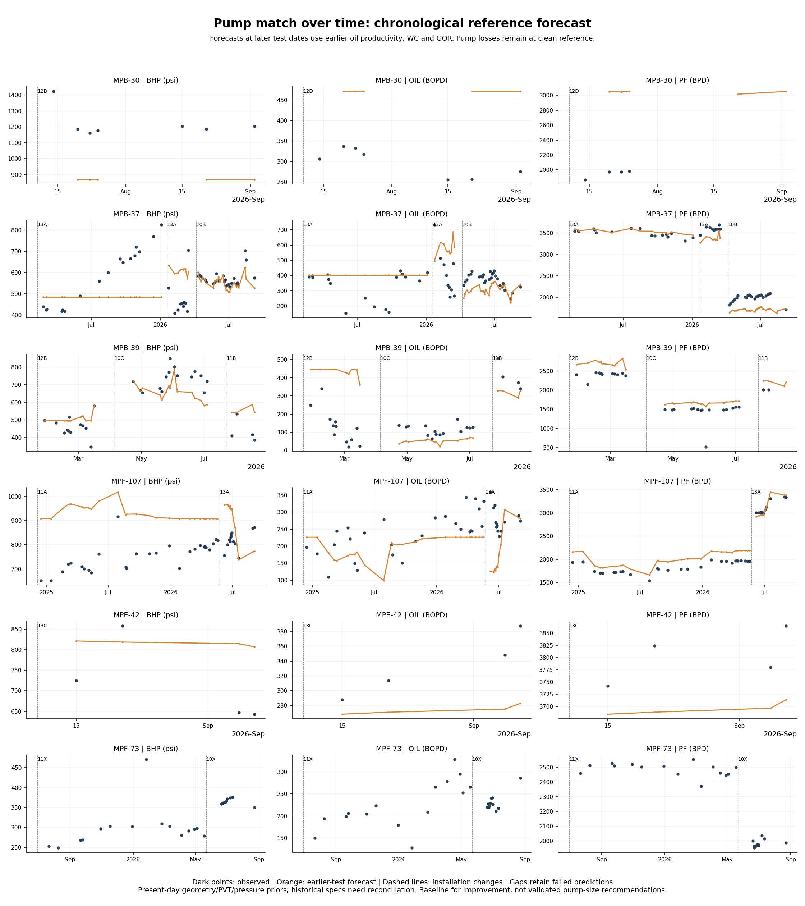

# September 11 resumed modeling work

The later [end-of-night handoff](session_close_2026-09-11.md) consolidates the
entire session and is the starting point for the next resume. The user asked
to stop for the night after documenting the work.

Later in this resumed session, [selectable return hydraulics](hydraulics_models_2026-09-11.md)
added Hagedorn–Brown/Griffith and Shi/Pan drift-flux alongside unchanged BB.
Tulsa remains unavailable pending full primary closure equations. The
[comparison over time](hydraulics_benchmark_2026-09-11.png) uses the same
six-well, 12-installation benchmark without retuning pump losses. On 130
common solved observations, BHP RMS is 130.7 / 127.6 / 146.5 psi and median
oil error is 26.8 / 28.9 / 34.9%, respectively. This supports retaining BB
as default and judging a fit on oil/PF/response as well as BHP.

The model selector, calibration job, installation-scoped save, optimizer
hydration and response cache now carry model identity. Shared-library patch
44 records these additions; the earlier verification section below describes
the preceding block before hydraulics was added. Latest checks: **1,962 Python
tests, 11 frontend tests and the TypeScript/Vite build passed**. No production
write or deployment was performed. The in-app Pump Match Over Time screen
remains planned.

The user resumed after the airport pause. The goal is **accurate JP-size
decisions under the marginal water cut of the pad, field or other constrained
system**. A fitted BHP level alone is not the acceptance test.

User clarifications now supersede the uncertainty in the airport handoff:

- Tracker nozzle/throat diameters are **nominal size specifications, never
  measurements of installed or recovered parts**. A discrepancy is a catalog,
  labeling or source-data issue; it is not evidence of wear.
- Gauges are typically within **40 ft of the JP**. The signed vertical offset
  remains unverified per well. A water-column correction over 40 ft is roughly
  18 psi, much smaller than the largest recorded misses; do not tune a large
  unconstrained datum shift to make the fit work.

## Completed application fixes

1. **S-Pad station coupling.** The flow sweep still generates discrete pump
   selections. Each distinct selection is re-solved against its actual station
   pressure, holding size and installed/replacement state fixed. No pump
   substitution or measured-rate fallback is used for qualification. Pressure
   residual and maximum flow must pass; narrowing a bracket around a
   discontinuity does not count as convergence. Winners are ranked on settled
   oil or settled oil-minus-water-price, according to the existing policy.
   The returned optimizer/grid is refreshed at the reported pressure.
   Selected-size batches use the existing bounded runner; duplicate selections
   share compact results. The search is still bounded and is not a certificate
   of the global optimum. Recommended-flow flags remain separate from pressure
   closure. Auto lambda is the price used at the originating search trial;
   the MILP/CP-SAT cross-check explicitly reports that search header.
2. **Match-health missing evidence.** Missing model results, fit quality,
   current-installation floor or well-specific response now yield `unknown`.
   Known contradictions, rails, weak fits and poor rate matches remain visible.
   Non-finite values are missing evidence. The UI labels the old `ok` status
   **no flags**, with no implication of independent validation. Hovering the
   verdict explains missing evidence. Historical railed-corner detection is
   unchanged; full identifiability/bound diagnostics remain future work.

The original synthetic pressure gap was **400 psi**. The same probe now returns
header 2,895 psi, selected PF 10,790 BPD, and curve pressure 2,892.1 psi: a
**-2.9 psi residual**, inside the default 10 psi tolerance. Oil remains 100 BOPD.
The empty health verdict changes from `ok` to `unknown`.
[Original probe](model_plan_optimization_probes_2026-09-11.json),
[after fixes](model_plan_optimization_probes_after_2026-09-11.json).

## Nominal-spec investigation

Three of the frozen plot's 35 current pumps have conflicting tracker specs:

| Well | Label | Model nozzle/throat, in | Tracker nozzle/throat, in | Catalog matches of tracker values |
|---|---|---|---|---|
| MPE-48 | National 14C | .2675 / .5519 | .2916 / .631 | Kobe nozzle 14, Guiberson throat 16 |
| MPM-62 | National 14B | .2675 / .4981 | .2916 / .576 | Kobe nozzle 14, Guiberson throat 15 |
| MPF-73 | National 10X | .1643 / .2370 | .1748 / .2431 | Kobe nozzle 10 and throat 9 |

This is an internal comparison against `data/jetpump_dimensions.json`, not a
new manufacturer certification. For MPE-48/MPM-62, tracker nozzle area is 18.8%
larger than the modeled nominal nozzle, with throat area about 31-34% larger.
Substituting those specs in a diagnostic, keeping the old losses/area factor
fixed, **worsens** BHP and PF matching; F-73 still cannot lift. Do not adopt the
raw numbers automatically or fit nozzle wear to compensate for the conflict.
[All results and source hashes](pump_spec_diagnostic_2026-09-11.json),
[tool](../tools/pump_spec_diagnostic.py).

## Cross-pump benchmark and time plot

Corrected a flaw in the airport preflight: it used Date Pulled to shorten pump
tenure. The canonical rule is **Date Set to next Date Set**, with changeout
days excluded from day-level comparisons. The original artifact is preserved;
[preflight v2](pump_lifetime_preflight_v2_2026-09-11.json) supersedes its counts:
**1,881 eligible tests, 143 installations with at least three tests, 29 candidate
wells with multiple supported configurations**, from 7,541 available tests.

Added a pure [benchmark service](../server/services/pump_history_benchmark.py)
and [offline runner](../tools/pump_history_benchmark.py). It uses adjacent
installations only, up to ten earlier tests for a Vogel oil-productivity anchor,
and a three-day training embargo before changeout. It will not bridge an
unobserved or omitted installation. Repeat sizes remain different physical
installations. Later BHP, oil and measured PF rate never enter the prediction
function or the training fit. Clean-reference pump coefficients are fixed;
there is no per-installation loss optimization or transfer of old wear.

Six wells cover **12 later installations and 163 tests**: MPB-30/37/39,
MPF-107/73 and MPE-42. The primary forecast freezes WC/GOR from earlier tests;
an explicitly conditional companion supplies measured later WC/GOR while
preserving the earlier oil IPR.

| Reference result | All later installations | Different-size installations only |
|---|---:|---:|
| Observations | 163 | 81 |
| Solved / failed | 135 / 28 | 68 / 13 |
| BHP RMS on successes | 141.8 psi | 119.6 psi |
| Oil median absolute percentage error on successes | 27.0% | 24.9% |
| PF median absolute percentage error on scorable successes | 10.1% | 11.4% |

These are **reference challenges, not validated sizing models**. Present-day
geometry/PVT/reservoir-pressure priors have not been reconstructed historically;
all six selected wells have nominal-spec flags somewhere in a compared
installation pair. Gauges have not been individually offset-corrected, and
observational changeouts do not establish causal gains for every alternative.
The benchmark establishes what a better calibrated model must beat.

MPB-37's 13A-to-10B period is promising (27/27 solves, BHP RMS 30.1 psi, oil
median absolute error 15.8%). It still has historical nominal-spec flags.
MPF-73 fails on both compared sizes. MPE-42's four 13C tests give BHP RMS
128.3 psi with default pump losses and the earlier 11C inflow; this differs
from the original plot and its separate same-test fits.

[Full benchmark and immutable prediction inputs](pump_history_benchmark_2026-09-11.json).
The plot was generated and visually checked:



This is the first offline Pump Match Over Time artifact. **The in-app screen
is still planned**, using the existing production/history strip, synchronized
BHP/oil/PF panels, installation boundaries, missing-period gaps and explicit
fitted-versus-predicted labels. Do not present this reference replay as a saved
calibration or enable it as an optimizer quality certificate.

## Next model work, ordered around sizing decisions

1. Reconcile actual manufacturer/nominal geometry for the training and target
   installations; verify completion/PVT/pressure history and signed gauge
   offset. Keep suspect periods visible with their reasons.
2. Separate reservoir/productivity evolution from pump losses. Train a
   constrained well model on several earlier installations, with shared
   geometry-dependent pump behavior and limited installation-specific effects.
   Profile the parameters: BHP/oil/PF must constrain them separately enough
   to predict another size. Do not give every test a new arbitrary IPR.
3. Test on complete later pressure events, another pump size, then another
   well withheld from shared-parameter fitting. Include failures and all
   qualifying observations; do not choose a correlation per scored date.
4. Validate **incremental oil per incremental machine water** and pressure
   response. Compare `delta_oil - lambda * delta_water`, where
   `lambda=(1-marginal_wc)/marginal_wc`. At 98% marginal WC, another 1,000 BPD
   of the constrained water stream needs about 20.4 BOPD; at 95%, about
   52.6 BOPD. Use the correct stream for the optimization problem. A pump
   change with a benefit comparable to forecast error is not a robust choice.
5. Qualify the low-GOR pressure-recovery and gas-entry assumptions and add a
   versioned hydraulic-model interface, then a documented alternative to
   Beggs-Brill. Evaluate the same frozen cross-pump cases. The earlier
   [model plan](jp_model_improvement_plan_2026-09-11.md) preserves the component
   balances, research sources and candidate hydraulic models.
6. Connect the history evidence to optimizer rows and expose recommendation
   stability across credible inputs/models. A matched level or agreeing
   allocation algorithms alone cannot qualify a new size.

## Verification and workspace state

- **1,905 Python tests passed**, four existing warnings, full offline suite.
- **9 frontend tests passed**; TypeScript/Vite production build passed with
  the existing chunk-size advisory. Updated `web/dist` is local.
- Anti-leakage, installation boundaries, failed-prediction coverage, coupled
  pressure residual, discontinuity rejection and hardware-state regressions
  cover the new behavior.
- Earlier recovered-review fixes remain intact. No shared-library physics
  was changed in this resumed block; no upstream patch number was added.
- No production writes, deployment, commit or staging. Keep Medium and the
  existing worker/cache limits. No subagents were started.

Run from the actual repository with `PYTHONPATH=.` and `WOFFL_MAX_WORKERS=1`:

```powershell
./venv/Scripts/python.exe tools/pump_lifetime_preflight.py
./venv/Scripts/python.exe tools/pump_spec_diagnostic.py --simulate
./venv/Scripts/python.exe tools/pump_history_benchmark.py
./venv/Scripts/python.exe tools/model_plan_optimization_probes.py
```

The preflight and probe defaults now write their v2/after artifacts. Preserve
the original September 8 and airport-pause outputs when extending experiments.
