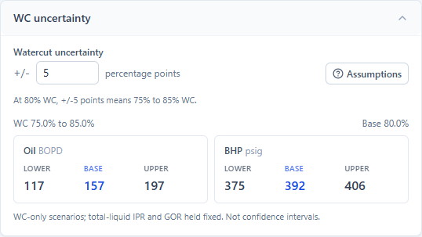

# Watercut uncertainty in the solver

The Single Well Solver now has a compact, expandable **WC uncertainty** card below
**Modeled vs Actual**. Enter a symmetric uncertainty in **percentage points** to
see lower, base and upper oil (BOPD) and suction BHP (psig) predictions. The initial
setting is +/-5 points; it is an illustrative setting, not an estimated Milne
test uncertainty. At 80% WC it represents 75% to 85%.

The current Solver also shows an installed/clean pump scope card in this group.
WC bounds use the selected hardware's effective coefficients. They neither save
that selection nor supply uncertainty bounds to optimization. See
[the save/run workflow](optimization_user_guide.md) and
[the final session handoff](session_learnings_2026-09-08.md). Verification counts
below describe the WC milestone; the later combined baseline is 1,861 Python
and 8 frontend tests, plus production build and browser checks.



## Calculation and interpretation

- `POST /api/solve/wc-uncertainty` runs the same `solve_single` path as the main
  prediction. It samples nine equally spaced offsets, including the unchanged
  base; WC is limited to 0-99%, and repeated clipped samples are deduplicated.
  Zero uncertainty runs once. The API permits uncertainty from 0 to 100 points.
- Total-liquid IPR rate, reference BHP, reservoir pressure, GOR, operating
  pressures, pump and coefficients stay fixed. Formation WC excludes returned PF.
  Each scenario creates fresh PVT objects and derives the oil IPR once from the
  unchanged liquid-rate reference. The resulting operating liquid rate can vary.
- Lower/upper values are extrema over successful samples, including interior
  points. They are sampled WC-only scenario ranges, not guaranteed continuous
  extrema or statistical confidence intervals. Gas, total-liquid and PF errors
  correlated with WC are outside this isolated sweep. Assumptions are available
  beside the control.
- Any unsuccessful or nonfinite scenario makes the range **incomplete**. The card
  reports the count and offers individual failure reasons. If the base fails,
  its value is blank; if every scenario fails, no numerical bounds are shown.
  Dewatering and base WC above 99% explicitly show that this feature is unavailable.
- This feature displays sensitivity. It does not fit WC, modify calibration or
  save simulation inputs to Databricks.

## Responsiveness

The card starts collapsed and adds no scenario work until opened. While open,
input edits debounce for 400 ms; stale bounds disappear immediately. Responses
are cached for 30 minutes by the complete request, so reopening the same inputs
does not recompute. New requests are limited to nine serial solves under the
existing shared CPU limit, with no new workers or deployment-tier changes.

A local nine-scenario Custom-well check took a median **205 ms** over five runs
(192-281 ms, cached profile, one CPU slot). This is local timing, not a hosted
Databricks performance measurement.

## Verification

- **1,832 Python tests passed**, including 15 new uncertainty cases covering
  interior extrema, liquid-rate convention, PVT isolation, exact base agreement,
  clipping, zero uncertainty, invalid inputs, partial/nonfinite/all failures,
  unsupported modes and the API's CPU limit.
- Both existing frontend tests passed; TypeScript checking and production build
  passed. `web/dist` was rebuilt.
- `tools/check_wc_uncertainty_ui.py` exercised the real React workbench in headless
  Chrome against local FastAPI compute routes. All warehouse access was blocked.
  It checked collapsed/cached behavior, editing and late responses, invalid drafts,
  zero width, clipping, injected partial/all failures, keyboard assumptions,
  narrow layout and dewatering. No browser JavaScript errors occurred.
- Desktop and narrow card screenshots were visually reviewed. The preview above
  uses an illustrative Custom well, not a field-validation claim.
- The browser check also exposed the Custom-well IPR chart waiting forever on
  disabled field-data queries. Its settle gate now skips those absent queries
  and waits for the Custom solve; the browser check guards that behavior.

For the optional browser check, start Vite in `web/` and install Playwright in a
local QA environment (it is not an application dependency), then run:

```powershell
$env:PYTHONPATH='build/browser-qa;.'
./venv/Scripts/python.exe tools/check_wc_uncertainty_ui.py
```

Source changes and the built bundle are local; deployment has not been performed.
